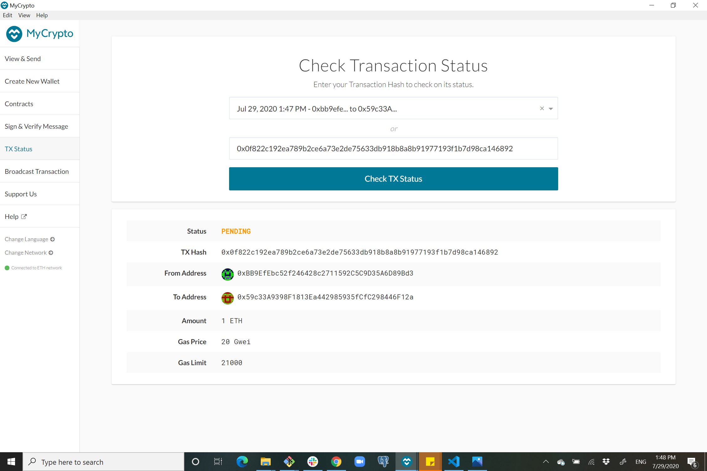

# Blockchain_network

## How to create and start a blockchain network?

In git bash nevigate to your Blockchain-Toolbox, now we need to create accounts for two nodes using the following command :
- ./geth account new --datadir node1

You will be asked to provied a password, the same command we will use for the second node, just changing node1 to node2.
 
In "Blockchain-Tools" folder there is now a new folder for each node. 

Next step will be to run puppeth to start configuring the network:

- ./puppeth.exe

I named the network "bear".

 Now we will choose to configure new gensis, we will choose the consensus engine to be proof of authority, 15 sec for blocktme and set the network ID to 777.

 We will pre-seal node1 and node2 accounts using their addresses and pre-fund them.

 Node1: 0xBB9EfEbc52f246428c2711592C5C9D35A6D89Bd3

 Node2:  0x59c33A9398F1813Ea442985935fCfC298446F12a

 

Now we want to export the gensis configuration to "bear_config" folder inside our "Blockchain-Tools" folder.
This will export 2 json files we will only need bear.json, we will use this file to write the gensis state to the nodes.

The command:
 
- ./geth init bear_config/bear.json --datadir node1

Again the same command we will use for the second node, just changing node1 to node2.

 

 In order to run and start the mining process we need to run the following commands. First we start with node1:

 - ./geth --datadir node1 --unlock "node1_address" --mine --rpc --allow-insecure-unlock.

 We only need to add RPC flag for the first node.

 We leave this to run and open a new git bash window for the next command.

For the second node the command will be a bit different, we will use the enode from the output of the last commnad we ran (to tell node1 to start mining) that will tell the node to communicate with the first node

- ./geth --datadir node2 --unlock "node2 address" --mine --port 30304 --bootnodes enode://f5e7830602921a4437ee03af5b7b832b2f41a386d7b200dd799897dedaa888f1ab24e5faa4dd584c86a927fb77589834c2749e37557fe625bb4fb801987d5d46@127.0.0.1:30303
--ipcdisable

Moving to My Crypto app, we will now add a custome network, we will need the network ID and the currency will be ETH.

Now we will login to our node1 account using keystore file in node1 folder.

Next we will provide the password we chose when we created node1 to get in to the account.

To make sure our blockchain network is working we will transfer 1 ETH from node1 account (which we are currently logged into)
to node2 account.

After pressing "Send Transaction" we copied the TX Hash to check the status.

We can see in the git bash window when node1 is running that the transaction is submitted.

